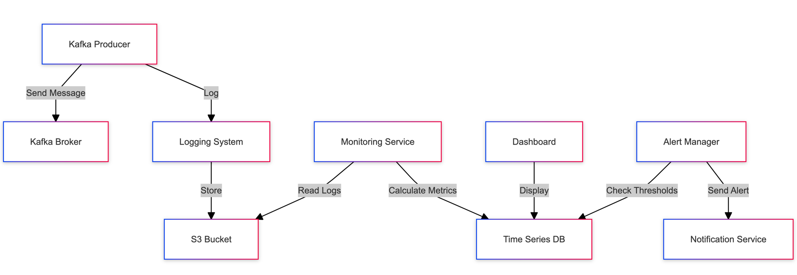

```graph
graph TD
    A[Kafka Producer] -->|Send Message| B[Kafka Broker]
    A -->|Log| C[Logging System]
    C -->|Store| D[S3 Bucket]
    E[Monitoring Service] -->|Read Logs| D
    E -->|Calculate Metrics| F[Time Series DB]
    G[Dashboard] -->|Display| F
    H[Alert Manager] -->|Check Thresholds| F
    H -->|Send Alert| I[Notification Service]
```
